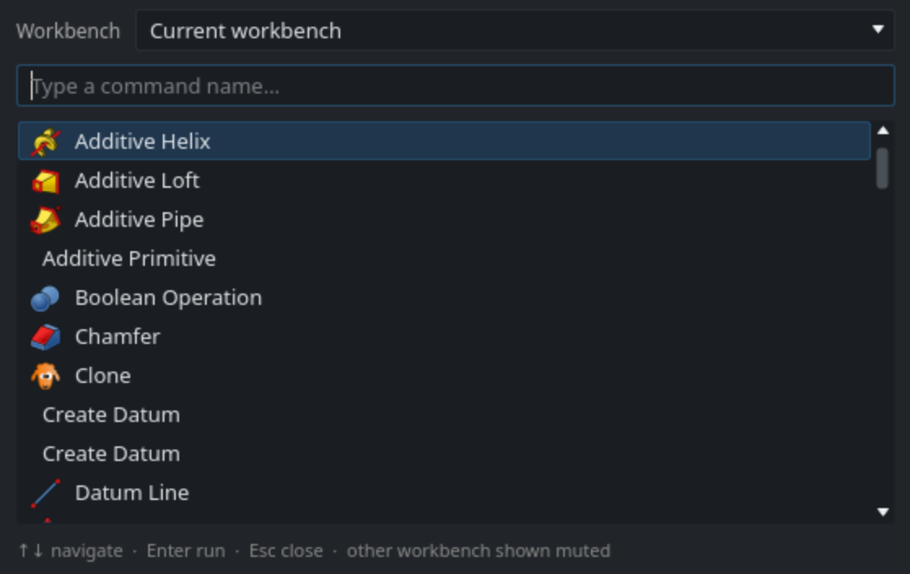
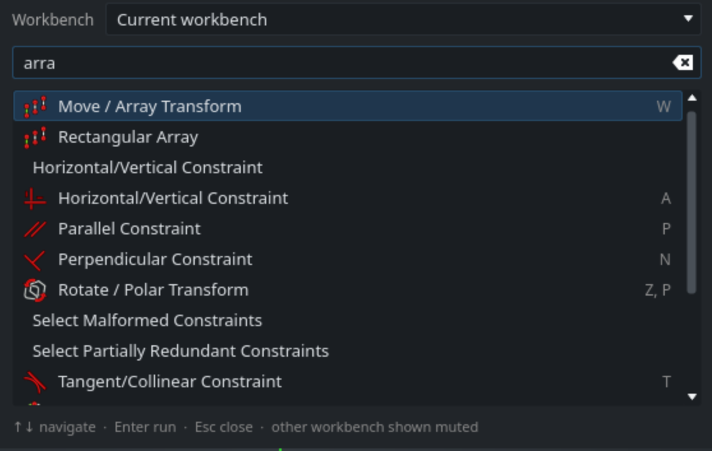

# ToolSeek

Type-to-find FreeCAD commands — a small command palette (AutoCAD-style), opened with a hotkey.

## Screenshots



*Command palette open — type to filter FreeCAD commands.*



*Live search — partial match with shortcuts and muted other-workbench results.*

## Install

Clone or symlink this project into FreeCAD’s **versioned** Mod folder as `ToolSeek`, then restart FreeCAD.

FreeCAD 1.0+ uses a `v1-0` / `v1-1` subdirectory (not the old top-level `Mod` alone).

| Install | Mod path |
| --- | --- |
| Linux (native/AppImage) | `~/.local/share/FreeCAD/v1-1/Mod/ToolSeek` |
| Linux (Flatpak) | `~/.var/app/org.freecad.FreeCAD/data/FreeCAD/v1-1/Mod/ToolSeek` |
| macOS | `~/Library/Application Support/FreeCAD/v1-1/Mod/ToolSeek` |
| Windows | `%APPDATA%\FreeCAD\v1-1\Mod\ToolSeek` |

Example (Flatpak FreeCAD 1.1):

```bash
ln -s /path/to/ToolSeek ~/.var/app/org.freecad.FreeCAD/data/FreeCAD/v1-1/Mod/ToolSeek
```

The Mod folder name must be `ToolSeek`. This addon uses the modern namespaced layout: FreeCAD loads `freecad/ToolSeek/__init__.py` and (in GUI mode) `freecad/ToolSeek/init_gui.py`. Symlink the **repository root** (the directory that contains `package.xml` and `freecad/`), not an inner package folder.

A clean start stays quiet in Report view. Failures use **Error**; shortcut conflicts and other real problems use **Warning**.

## Usage

1. Press **Ctrl+Space** (or your configured shortcut), or choose **Tools → ToolSeek…**.
2. Type part of a command’s display name or internal id (e.g. `box`, `part fillet`, `line`).
3. Use **↑ / ↓** to move, **Enter** to run, **Esc** to close.

Keyboard shortcuts for each command appear right-aligned in the results list when FreeCAD exposes them.

### Preferences

Open **Edit → Preferences → ToolSeek**, or **Tools → ToolSeek preferences…**.

| Option | Default | Effect |
| --- | --- | --- |
| **Result style** | Icons | **Icons** = icons + labels; **Words** = labels only (no icons) |
| **Allow fuzzy matching** | On | Small typos / subsequences still match (exact/prefix/word always rank higher) |
| **Allow selection to switch workbench** | On | When off, other-workbench results still show and run, but without `activateWorkbench` |
| **Open palette shortcut** | Ctrl+Space | Click the field and press keys to record a chord (`OpenShortcut` pref). Reset restores the default. |

Stored under `User parameter:BaseApp/Preferences/Mod/ToolSeek`. Palette display prefs are read when the palette opens; the open shortcut is applied at startup and reloaded when preferences are saved.

Before applying a new shortcut, ToolSeek scans main-window **QActions**, **QShortcuts**, and FreeCAD command **Accel** bindings. If the chord is already taken, the change is refused, the previous ToolSeek shortcut is kept, and a warning is shown (dialog and/or Report view). ToolSeek’s own binder is excluded so rebinding is not a false positive.

### Ranking

Results prefer **menu labels** over internal command ids, and **whole-word / leading-word** hits over mid-string matches. Commands from the **active workbench** (by name prefix, e.g. `Sketcher_…`) are boosted so queries like `line` surface that workbench’s Line tool first.

Lightweight **fuzzy** matching (when enabled) still finds near-misses, but exact, prefix, and word matches always rank above fuzzy hits.

### Cross-workbench results

Commands from another workbench stay selectable. They appear in a muted slate color with a `· Workbench` suffix (distinct from inactive grey). Running one best-effort **activates that workbench** first (unless disabled in preferences), then `Gui.runCommand`.

Inactive commands (best-effort flag; `Command.isActive()` is never called) are listed in grey but can still be selected.

### NeoRibbon / custom UI

ToolSeek does **not** rely on FreeCAD’s `Gui.appendMenu` Accel alone. It:

- injects **Tools → ToolSeek…** via Qt (so it still shows when `appendMenu` is ignored), and
- installs a main-window **QShortcut** for the configured open hotkey.

If NeoRibbon hides the menu bar, use the open shortcut, or temporarily show the menu bar / use the Python console: `Gui.runCommand("ToolSeek_Open")`.

## Change the shortcut

Prefer **Edit → Preferences → ToolSeek** (or **Tools → ToolSeek preferences…**), click **Open palette shortcut**, then press the desired keys (e.g. `Alt+P`). Use **Reset** to restore `Ctrl+Space` (still conflict-checked).

Avoid also assigning the same chord under **Tools → Customize… → Keyboard** for `ToolSeek_Open` — that Accel plus the addon QShortcut can double-trigger (palette opens and closes).

## What is indexed

Only **commands currently registered** in FreeCAD when you open the palette (typically the active workbench plus previously loaded ones). Commands from workbenches you have never opened in this session may be missing until you switch to that workbench once.

This addon does **not** search preferences, document objects, or menus.

## Dev check

Matcher ranking (no FreeCAD needed):

```bash
python -m unittest tests.test_matcher -v
```

Optional packaging / typing deps (see `pyproject.toml`):

```bash
pip install -e ".[dev]"
```

## Changelog

See [CHANGELOG.md](CHANGELOG.md) for release notes (Keep a Changelog).

## License

- **Code** (`LICENSE`, `LICENSE-Code`): [LGPL-2.1-or-later](LICENSE)
- **Assets** (`LICENSE-Assets`) — icons under `Resources/` / `freecad/ToolSeek/resources/`, and screenshots under `Resources/Media/` (and `Images/`): [CC-BY-4.0](LICENSE-Assets)
